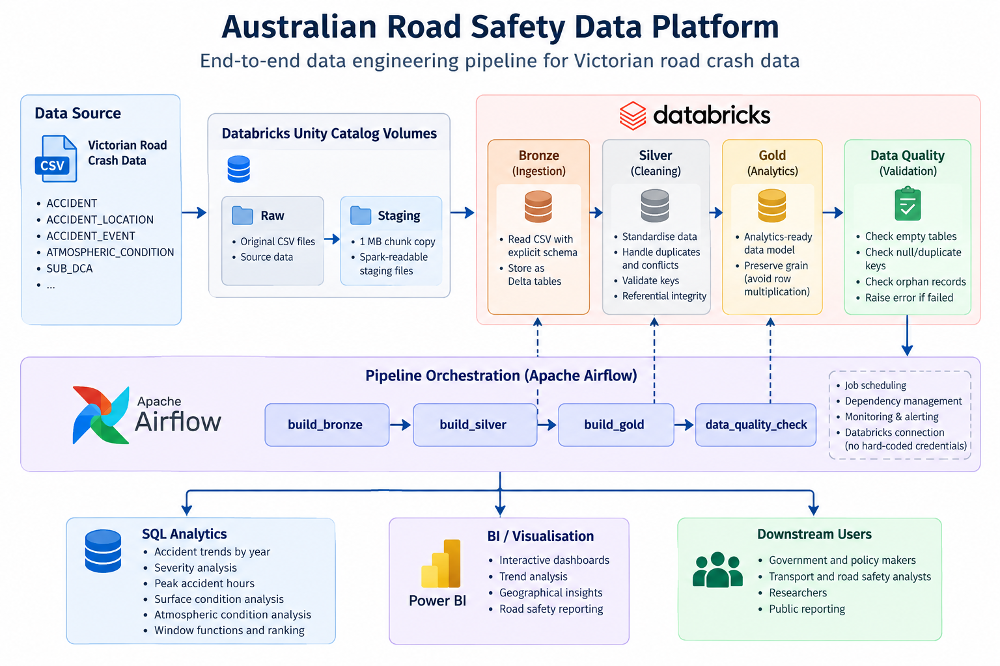

# Australian Road Safety Data Platform

An end-to-end data engineering project that transforms Victorian road crash data into reliable, analytics-ready datasets using Databricks, PySpark, Delta Lake, Apache Airflow, and SQL.

## Project Overview

This project builds a data pipeline for Victorian road crash data using a Medallion Architecture.

The pipeline ingests raw CSV datasets, cleans and validates the data, models analytics-ready Gold tables, performs automated data quality checks, and uses Apache Airflow to orchestrate Databricks jobs.

## Architecture



### Pipeline

Raw CSV Data  
↓  
Databricks Unity Catalog Volumes  
↓  
Bronze Layer  
↓  
Silver Layer  
↓  
Gold Layer  
↓  
Data Quality Checks  
↓  
SQL Analytics

Apache Airflow orchestrates the Databricks pipeline:

Bronze → Silver → Gold → Data Quality

## Tech Stack

- Python
- PySpark
- SQL
- Databricks
- Delta Lake
- Unity Catalog
- Apache Airflow
- Git & GitHub

## Data Architecture

### Bronze Layer

Raw Victorian road crash CSV datasets are ingested from Unity Catalog Volumes and stored as Delta tables.

Explicit Spark schemas are used to provide predictable ingestion and data types.

A staging layer with chunked file copying was introduced after diagnosing anomalous Spark read behaviour on the initially uploaded CSV objects.

### Silver Layer

The Silver layer cleans, standardises, and validates the Bronze datasets.

Key transformations include:

- Converting accident date and time fields into typed date/timestamp columns
- Removing exact duplicate NODE records
- Detecting conflicting NODE business keys
- Preserving conflicting records using an `IS_KEY_CONFLICT` data quality flag
- Validating primary and composite keys
- Checking referential integrity using Spark left anti joins

### Gold Layer

The Gold layer provides analytics-ready data products while preserving the natural grain of each dataset.

Main tables:

- `gold_accident` — one row per accident
- `gold_accident_surface` — one row per accident/surface condition
- `gold_accident_atmosphere` — one row per accident/atmospheric condition
- `gold_accident_node` — accident node/geographic records with conflict flags

One-to-many datasets are kept separate rather than being joined into a single wide table to prevent many-to-many row multiplication.

## Data Quality

Automated data quality checks validate:

- Empty Gold tables
- Null accident identifiers
- Duplicate accident identifiers
- Orphan surface-condition records
- Orphan atmospheric-condition records

If a validation fails, the Databricks task raises an exception. The failure propagates to Apache Airflow and prevents the pipeline from being treated as successful.

## Airflow Orchestration

Apache Airflow orchestrates the Databricks jobs in dependency order:

`build_bronze → build_silver → build_gold → data_quality_check`

Airflow is responsible for orchestration and monitoring, while Databricks performs the distributed PySpark transformations and Delta Lake stores the processed datasets.

Databricks authentication is managed through an Airflow Connection rather than hard-coded credentials.

## SQL Analytics

The Gold layer is queried using SQL for analytical use cases including:

- Accident trends by year
- Severity analysis
- Peak accident hours
- Road surface conditions
- Atmospheric conditions
- Window-function based ranking

For one-to-many condition tables, `COUNT(DISTINCT ACCIDENT_NO)` is used where appropriate to avoid inflated accident counts.

## Repository Structure

```text
australian-road-safety-data-platform/
│
├── notebooks/
│   ├── 01_bronze_ingestion.py
│   ├── 02_silver_transformation.py
│   ├── 03_gold_modelling.py
│   ├── 04_data_quality.py
│   └── 05_sql_analytics.py
│
├── dags/
│   └── road_safety_pipeline.py
│
├── src/
│   ├── profile_data.py
│   └── transform_silver.py
│
├── tests/
│   └── test_databricks_connection.py
│
├── .gitignore
└── README.md